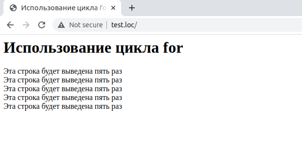

## 2.15 Циклы FOR
Одним из основных назначений компьютеров является обработка больших
объемов информации. Например, требуется подсчитать среднюю оценку на 
выборке из 10000 студентов. Выполнение этой задачи вручную займет уйму времени и не гарантировано от отсутствия ошибок. Но для компьютера это является тривиальным действием. Компьютеры обрабатывают повторяющиеся действия при помощи циклов, и первым типов циклов, которые рассматриваются ниже,будут циклы `for`, предназначенные для повторения выполнения определенного оператора (который может быть и составным). Синтаксис цикла `for` приведен
ниже:  
```php
for (expressionl; expression2; expression3) statement
```
В выражении *expression1* производится инициализации цикла, чаще всего в нем выполняется присваивание начального значения определенной переменной (счетчику цикла). Обычно счетчик цикла используется для подсчета количества раз исполнения оператора *statement* (тела цикла). Выражение *expression1* выполняется однократно перед выполнением собственно цикла.
Следующие выражение, *expression2*, задает условие повторения цикла. Цикл продолжает выполняться до тех пор, пока это выражение остается истинным. Первый раз условие проверяется до выполнения оператора *statement*, так что если условие цикла будет ложным с самого начала, тело цикла не будет исполнено не разу. Обычно условие используется для проверки текущего значения счетчика цикла. Наконец, третье выражение, *expression3*, выполняется каждый раз после тела цикла. Обычно оно используется для изменения (например, увеличения) счетчика цикла.  

Ниже приведен простой пример использования цикла `for`. В примере 2.7
цикл используется для того, чтобы вывести заданную строку пять раз. Цикл начинается с присваивания счетчику цикла — переменной `$counter` — 
значения 0. Счетчик увеличивается каждый раз, когда выполняется тело цикла, при этом проверяется условие повторения цикла с тем, чтобы цикл исполнился ровно 5 раз.  
Пример 2.7. Использование цикла for  

  
******
Выражения в цикле `for` при необходимости могут обрабатывать несколько
счетчиков цикла, при этом для разделения отдельных подвыражений 
используется оператор запятая `«,»`. Ниже приведен пример цикла с двумя счетчиками:
```php
for ($var1 = 1, $var2 = 2; $var1 < 5 && $var2 < 5; $var1++ , $var2++)
{
    echo "$var1 x $var2 = ", $var1*$var2, "<BR>";
}
```
Результатом выполнения этого примера будут следующие строки:
```php
1 x 2 = 2
2 x 3 = 6
3 x 4 = 12
```  
Впрочем, в цикле `for` использовать счетчики необязательно. Ниже 
приведен пример цикла с использованием гипотетических функций доступа к данным. Функция initialize_cоnnееtion устанавливает соединение, функция check_for_data возвращает TRUE при наличии данных и FALSE при их отсутствии, и, наконец, функция move_to_next_item предназначена для получения следующей порции данных. Как видно, явного изменения каких-то переменных в теле цикла не производится.
```php
for (initialize_connection (); check_for_data (); move_to_next_item ())
{
    echo "Обработка данных<ВК>";
}
```