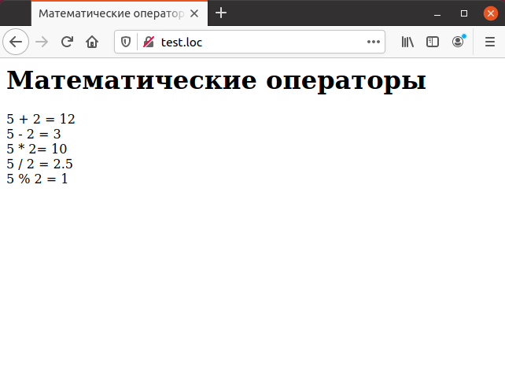

# 2.1 PHP Математические операторы и математические функции

Предыдущая глава посвящена введению в язык РНР, а в данной главе описываются основные операторы языка. Во-первых, к ним относятся операторы обработки данных—арифметические, строковые и битовые. Например, при работе с численными данными широко используются операторы сложения («+»), вычитания («-»), умножения («*») и т.д. Все операторы перечислены в табл. 2.1.
Во-вторых, ниже описываются также основные управляющие конструкции языка — условные операторы и операторы циклов. При помощи условного оператора можно выполнять те или иные фрагменты кода в зависимости от значения некоторого условия. Наличие подобных средств в языке позволяют формировать динамические HTML-страницы, для чего прежде всего и предназначен язык РНР. При помощи циклов становится возможным эффективно обрабатывать большие объемы данных. Эта тема раскрывается далее в гл. 3, где описывается работа со строками и массивами.

## Математические операторы

Численные данные обрабатываются при помощи следующих 
фундаментальных операторов языка РНР:

* `+`      Сумма двух чисел.
* `-`       Разность двух чисел.
* `*`       Произведение двух чисел.
* `/`      Частное от деления двух чисел.
* `%`      Остаток отделения одного числа на другое (частное по модулю).

Пример демонстрирует использование математических операторов языка.

```php
<HTML>
    <HEAD>
    <TITLE>
        Математические операторы
    </TITLE>
    </HEAD>
    <BODY>
        <H1>
            Математические операторы
        </H1>
        <?php
            echo "5 + 2 = ",5 + 7, "<BR>"; 
            echo "5 - 2 = ", 5 - 2, "<BR>";
            echo "5 * 2= ", 5 * 2, "<BR>";
            echo "5 / 2 = ", 5 / 2, "<BR>";
            echo "5 % 2 = ", 5 % 2, "<BR>";
        ?>
    </B0DY>
</HTMI>
```

Результат выполнения данного примера представлен на изображении ниже:



## Математические функции

Наряду с математическими операторами, в РНР предусмотрено большое количество математических функций. 
Ниже приведен перечень наиболее часто употребительных функций:

* [abs()](https://www.php.net/manual/ru/function.abs.php) Абсолютное значение (модуль) числа.
* [acos()](https://www.php.net/manual/en/function.acos.php) Арккосинус.
* [acosh()](https://www.php.net/manual/en/function.acosh) Гиперболический арккосинус.
* [asin()](https://www.php.net/manual/en/function.asin.php) Арксинус.
* [asinh()](https://www.php.net/manual/en/function.asinh.php) Гиперболический арксинус.
* [atan2()](https://www.php.net/manual/en/function.atan2.php) Арктангенс частного двух переменных.
* [atan()](https://www.php.net/manual/en/function.atan.php) Арктангенс.
* [atanh()](https://www.php.net/manual/en/function.atanh.php) Гиперболический арктангенс.
* [base_convert()](https://www.php.net/manual/en/function.base-convert.php) Преобразование чисел в строковом представлении из одной
системы счисления в другую.
* [bindec()](https://www.php.net/manual/en/function.bindec.php) Преобразование строки, представляющей двоичное число, в 
целочисленное значение.
* [ceil()](https://www.php.net/manual/en/function.ceil.php) Округление числа в большую сторону.
* [cos()](https://www.php.net/manual/en/function.cos.php) Косинус.
* [cosh()](https://www.php.net/manual/en/function.cosh.php) Гиперболический косинус.
* [decbin()](https://www.php.net/manual/en/function.decbin.php) Преобразование числа в двоичное представление в виде строки.
* [dechex()](https://www.php.net/manual/en/function.dechex.php) Преобразование числа в шестнадцатеричное представление в виде
строки.
* [decoct()](https://www.php.net/manual/en/function.decoct.php) Преобразование числа в восмеричное представление в виде строки.
* [deg2rad()](https://www.php.net/manual/en/function.deg2rad.php) Преобразование градусов в радианы.
* [exp()](https://www.php.net/manual/en/function.exp.php) Вычисление экспоненты заданного числа.
* [floor()](https://www.php.net/manual/en/function.floor.php) Округление числа в меньшую сторону.
* [fmod()](https://www.php.net/manual/en/function.fmod.php) Вещественный остаток от деления двух чисел.
* [getrandmax()](https://www.php.net/manual/en/function.getrandmax.php) Максимальное значение, которое можно получить функцией
* [rand()](https://www.php.net/manual/en/function.rand.php) Генератор случайынх числел.
* [hexdec()](https://www.php.net/manual/en/function.hexdec.php) Преобразование строки, представляющей шестнадцатеричное
число, в целочисленное значение.
* [hypot()](https://www.php.net/manual/en/function.hypot.php) Вычисление гипотенузы по двум катетам.
* [is_finite()](https://www.php.net/manual/en/function.is-finite.php) Проверка, является ли значение конечным вещественным
числом.
* [is_infinite()](https://www.php.net/manual/en/function.is-infinite.php) Проверка, является ли значение бесконечностью (может
возникнуть, например, в результате вычисления значения логарифма
нуля).
* [is_nan()](https://www.php.net/manual/en/function.is-nan.php) Проверка, является ли значение специальным значением NAN
(not-a-number, результат выполнения некорректной математической 
операции).
* [lcg_value()](https://www.php.net/manual/en/function.lcg-value.php) Генератор псевдослучайных чисел.
* [logl10()](https://www.php.net/manual/en/function.log10.php) Десятичный логарифм.
* [log()](https://www.php.net/manual/en/function.log.php) Натуральный логарифм.
* [max()](https://www.php.net/manual/en/function.max.php) Максимум заданных чисел.
* [min()](https://www.php.net/manual/en/function.min.php) Минимум заданных чисел.
* [mt_getrandmax()](https://www.php.net/manual/en/function.mt-getrandmax.php) Максимальное значение, которое можно получить функцией mtr and ().
* [mt_srand()](https://www.php.net/manual/en/function.mt-srand.php) Генератор псевдослучайных чисел по алгоритму витка Мерсен-
на.
* [mt_rand()](https://www.php.net/manual/en/function.mt-rand.php) Генератор псевдослучайных чисел по алгоритму витка Мерсен-
на1.
* [pi()](https://www.php.net/manual/en/function.pi.php) Значение числа пи.
* [pow()](https://www.php.net/manual/en/function.pow.php) Возведение в степень.
* [rad2deg()](https://www.php.net/manual/en/function.rad2deg.php) Преобразования радианов в градусы.
* [round()](https://www.php.net/manual/en/function.round.php) Округление числа.
* [sin()](https://www.php.net/manual/en/function.sin) Синус.
* [sinh()](sinh) Гиперболический синус.
* [sqrt()](https://www.php.net/manual/en/function.sqrt.php) Квадратный корень.
* [srand()](https://www.php.net/manual/en/function.srand.php) Инициализация генератора псевдослучайных чисел.
* [tan()](https://www.php.net/manual/en/function.tan.php) Тангенс.
* [tanh()](https://www.php.net/manual/en/function.tanh) Гиперболический тангенс.

Ниже приведен пример извлечения квадратного корня:

```php
<?php
   echo "sqrt(49) = ", sqrt(49);
?>
```

В результате выполнения данного фрагмента кода будет выведена 
следующая строка:

```php
sqrt (49) = 7
```
