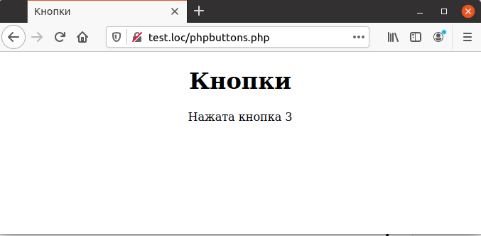

## 5.13 Кнопки:вариант 1  
Кнопки часто используются на HTML-страницах. Кнопки отличаются от остальных элементов управления тем, что они не остаются нажатыми после щелчка по ним. Поэтому в тот момент, когда данные посылаются скрипту-обработчику, кнопка уже давным-давно находится в отжатом состоянии. Как же определить, какая именно кнопка была нажата? Для этого можно использовать различные способы, и три из них приведены в этой главе.  
Одним из возможных
вариантов является комбинированное использование PHP, JavaScript и скрытого поля, как показано в примере 5.19. Когда пользователь щелкает по кнопке, функция JavaScript сохраняет соответствующую кнопке строку в скрытом поле и затем использует функцию [`submit`](https://learn.javascript.ru/forms-submit) для отправки результатов на web-сервер
скрипту phpbuttons.php.  
  
Пример 5.19. Страница с тремя кнопками (вариант 1), phpbuttons1.html
```php
<HTML>
    <HEAD>
        <TITLE>
            Кнопки : вариант 1
        </TITLE>
    </HEAD>
    <BODY>
        <CENTER>
            <H1>
                Кнопки : вариант 1
            </H1>
            <FORM NAME="form1" METHOD="POST" ACTION="phpbuttons1.php">
                <INPUT TYPE="HIDDEN" NAME="Button">
                <INPUT TYPE="BUTTON" VALUE="Кнопка 1" ONCLICK="buttonl ()">
                <INPUT TYPE="BUTTON" VALUE="Кнопка 2" 0NCLICK="button2 ()">
                <INPUT TYPE="BUTTON" VALUE="Кнопка 3" 0NCLICK="button3 ()">  
            </FORM>
            <SCRIPT LANGUAGE="JavaScript">
                <!
                function button1 ()
                {
                    document.form1.Button.value = "кнопка 1"
                    forml.submit ()
                    }
                function button2 ()
                {
                    document.form1.Button.value = "кнопка 2"
                    forml.submit ()
                }
                function button3 ()
                {
                    document.form1.Button.value = "кнопка 3"
                    forml.submit ()
                }
                // ->
            </SCRIPT>
        </CENTER>
    </BODY>
</HTML> 
```  

На рис. 5.19 представлен внешний вид рассмотренной формы с тремя 
кнопками.
  

Рис. 5.19. Страница с тремя кнопками : вариант 1  

Для определения того, какая кнопка нажата, следует всего лишь прочесть содержимое скрытого поля Button, как показано в примере 5.20. Результат выполнения скрипта в случае, если пользователь щелкнул по третьей кнопке, приведен на рис. 5.20.  

Пример 5.20. Отображение загруженного файла, phpbuttons1.html
```php
<HTML>
    <HEAD>
        <TITLE>
            Кнопки
        </TITLE>
    </HEAD>
    <BODY>
        <CENTER>
            <H1>Кнопки</H1>
            Нажата 
            <?php
                if (isset($_REQUEST["Button"])){
                    echo $_REQUEST["Button"], "<BR>";
                }
            ?>
        </CENTER>
    </BODY>
</HTML>
```

  

Рис. 5.20. Отображение нажатой кнопки

